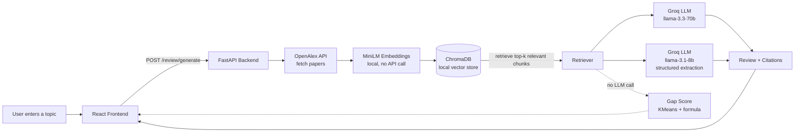
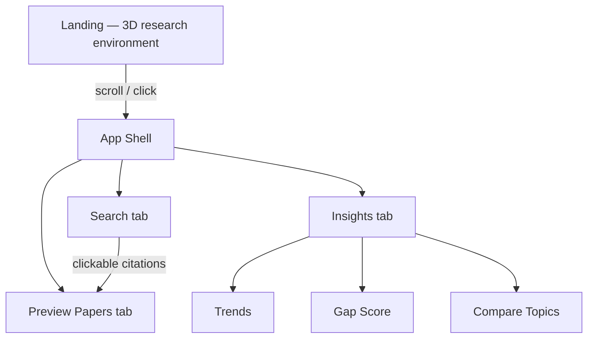
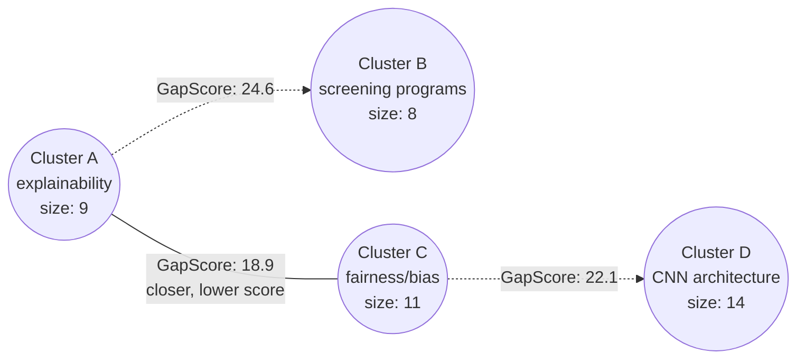

# ResearchLens

**An AI-assisted research tool that turns a topic into a grounded literature review.**

Search a topic → ResearchLens pulls real papers, retrieves the most relevant ones, and writes a literature review with real in-text citations. Explore publication trends, and surface candidate research gaps with a formula that never calls an LLM.

> **Status:** actively in development. Search, Preview Papers, Trends, and Gap Score are fully integrated end-to-end. Compare Topics is UI-complete but not yet wired to a real backend endpoint. See [Roadmap](#roadmap).

---

## Table of contents

- [Why this exists](#why-this-exists)
- [Features](#features)
- [Architecture](#architecture)
- [Gap Score — the formula, explained](#gap-score--the-formula-explained)
- [Tech stack](#tech-stack)
- [Project structure](#project-structure)
- [Setup](#setup)
- [Environment variables](#environment-variables)
- [API reference](#api-reference)
- [Design decisions](#design-decisions)
- [Roadmap](#roadmap)
- [License](#license)

---

## Why this exists

General-purpose LLM chatbots can summarize research, but they have a well-documented failure mode: they can hallucinate citations, titles, and authors because they generate text from memory rather than querying a live academic index. ResearchLens is built around the opposite approach — every citation in a generated review is grounded in a real, retrieved excerpt from a real paper found via [OpenAlex](https://openalex.org), not recalled from the model's training data.

---

## Features

### 🔍 Search → Literature Review
Enter a topic. The backend fetches real papers from OpenAlex, embeds and stores them locally (ChromaDB + MiniLM), retrieves the most relevant subset, and generates a multi-section literature review with real `(Author, Year)` in-text citations — each one clickable, jumping straight to its source paper.

### 📄 Structured Extraction *(backend complete, frontend view pending)*
For every cited paper, one batched Groq call extracts four fixed fields: **Methodology, Dataset, Key Finding, Limitation**. If a field genuinely isn't stated in the abstract, the model is instructed to say so explicitly rather than guess — which also powers a free **Extraction Completeness Score** (% of fields actually filled in).

### 📚 Preview Papers
Every paper behind the review, in one place — hover for a full preview card (abstract, authors, venue), click through to the real DOI, or copy a ready-made citation in **APA, MLA, or BibTeX**.

### 📈 Trends
Publication counts by year, **emerging vs. saturated keywords** (via TF-IDF comparing recent vs. older years), and top authors for any topic — computed fresh from OpenAlex, independent of search history.

### 🕳️ Gap Score
Clusters retrieved papers by topic using KMeans on their embeddings, then scores every pair of clusters with a custom formula to flag **candidate research gaps** — two well-established, active research areas that remain conceptually unconnected. See the [full explanation below](#gap-score--the-formula-explained). This is the project's core novelty: **zero LLM calls**, fully classical statistics, fully reproducible.

### 📤 Export
Download the generated review as a real, paginated **PDF** (client-side, via jsPDF) or Markdown, with formatted references included.

---

## Architecture



**The important boundary in this diagram:** everything below the dotted line (Gap Score) never touches an LLM. Everything above it does. That distinction matters — see [Design decisions](#design-decisions).

### Frontend structure



---

## Gap Score — the formula, explained

```
GapScore(A, B) = 100 × Density(A) × Density(B) × AvgRecency(A, B) × NormDistance(A, B)
```

| Term | Meaning |
|---|---|
| `Density(C)` | `size(C) / total_papers` — how established that cluster/topic area is |
| `Recency(C)` | How recent that cluster's papers are on average, scaled 0–1 across the result set |
| `AvgRecency(A,B)` | Average of `Recency(A)` and `Recency(B)` |
| `NormDistance(A,B)` | Euclidean distance between cluster centroids in embedding space, scaled 0–1 across every cluster pair |

**Why multiply by distance, not divide:** two clusters sitting close together in embedding space are already the same research area — there's no gap between them by definition. The interesting case is two clusters that are each well-established (high density) and currently active (high recency), but sit **far apart** conceptually. That's two serious, active bodies of work that haven't been connected — sometimes called a *structural hole* in network science, and a legitimate, defensible candidate for a bridging research contribution.


*(Dotted lines = higher GapScore = larger conceptual distance between two active, established clusters — a stronger candidate gap.)*

Every step — KMeans clustering (`k` auto-selected via silhouette score), TF-IDF cluster labeling, density/recency/distance — runs locally with `scikit-learn`. The only place a pretrained model touches this pipeline is the embedding step, which converts text to numbers the same way a calculator converts digits to a result — it doesn't reason or generate anything.

---

## Tech stack

| Layer | Tools |
|---|---|
| **Backend** | FastAPI, ChromaDB, Groq (`llama-3.3-70b-versatile`, `llama-3.1-8b-instant`), scikit-learn (KMeans, TF-IDF, silhouette score), python-docx, ReportLab |
| **Frontend** | React 18, Vite, Tailwind CSS, Framer Motion, Three.js / React Three Fiber, jsPDF |
| **Data source** | [OpenAlex API](https://openalex.org) — free, no key required |
| **Embeddings** | MiniLM (via ChromaDB's bundled ONNX embedding function) — runs locally, no API call |

---

## Project structure

```
ResearchLens/
├── README.md
├── .gitignore
│
├── backend/
│   ├── main.py                  FastAPI app, router registration
│   ├── config.py                Settings (.env loading)
│   ├── requirements.txt
│   ├── db/
│   │   └── chroma_client.py     ChromaDB connection
│   └── features/
│       ├── papers/              OpenAlex search + cleanup
│       │   ├── fetcher.py
│       │   ├── service.py
│       │   ├── schemas.py
│       │   └── router.py
│       ├── embeddings/          Vector storage
│       ├── review/              RAG generation, extraction, export
│       │   ├── retriever.py
│       │   ├── generator.py
│       │   ├── extractor.py     Structured extraction table
│       │   ├── exporter.py      docx/PDF generation
│       │   ├── service.py
│       │   └── router.py
│       ├── trends/               Year counts, keyword analysis
│       └── gaps/                 Gap Score
│           ├── embedder.py
│           ├── clusterer.py
│           ├── labeler.py
│           ├── formula.py
│           └── service.py
│
└── researchlens-frontend/
    └── src/
        ├── lib/
        │   ├── api.js            <- the one file that talks to the backend
        │   ├── citations.js       APA/MLA/BibTeX formatting
        │   └── mockData.js
        ├── hooks/
        └── components/
            ├── Landing/, Landing3D/   3D research-environment hero
            ├── Shell/                 Sidebar, tabs, app frame
            ├── Search/                Topic search, filters, review
            ├── Preview/               Paper list, hover cards
            └── Insights/              Trends, Gap Score, Compare Topics
```

---

## Setup

### Backend

```bash
cd backend
python -m venv venv
venv\Scripts\Activate.ps1        # Windows
# source venv/bin/activate       # macOS/Linux

pip install -r requirements.txt
copy .env.example .env           # macOS/Linux: cp .env.example .env
```

Fill in your `.env` (see [Environment variables](#environment-variables)), then:

```bash
uvicorn main:app --reload
```
→ `http://localhost:8000` · interactive API docs at `http://localhost:8000/docs`

### Frontend

```bash
cd researchlens-frontend
npm install
npm run dev
```
→ `http://localhost:5173`

By default the frontend calls the real backend. To work on the UI without the backend running, set `USE_MOCK_DATA = true` at the top of `src/lib/api.js`.

---

## Environment variables

Set in `backend/.env` (never committed — see `.gitignore`):

| Variable | Required | Description |
|---|---|---|
| `GROQ_API_KEY` | Yes | Free key from [console.groq.com](https://console.groq.com). Powers review generation and structured extraction. |
| `OPENALEX_EMAIL` | No | Any email — puts requests in OpenAlex's faster "polite pool." Not verified. |

---

## API reference

All endpoints are `POST` unless noted, and accept/return JSON.

| Endpoint | Purpose |
|---|---|
| `GET /health` | Health check |
| `POST /papers/search` | Search OpenAlex for papers on a topic |
| `POST /embeddings/store` | Embed and store papers in ChromaDB |
| `POST /review/generate` | Full pipeline: search → retrieve → generate review → extract structured data |
| `GET /review/download/{filename}` | Download a generated docx/PDF |
| `POST /trends/analyze` | Year counts, keyword trends, top authors for a topic |
| `POST /gaps/analyze` | Cluster papers and compute Gap Scores |

Full interactive documentation (request/response schemas, try-it-out) is auto-generated by FastAPI at `http://localhost:8000/docs` once the backend is running.

---

## Design decisions

- **Gap Score is deliberately LLM-free.** Clustering, density, recency, and distance are all classical statistics computed locally with `scikit-learn`. This is the project's defensible novelty claim: reproducible, deterministic (fixed random seed), and fully explainable without depending on any model's judgment call.
- **Structured extraction is *not* LLM-free, on purpose.** Turning free text into structured fields needs a language model — that's a different, legitimate kind of claim than Gap Score's, and the two shouldn't be presented as the same type of contribution.
- **References are grounded, not generated.** Every citation traces back to a real retrieved excerpt, never the LLM's memory — directly addressing the hallucinated-citation problem documented in general-purpose LLM research tools.
- **One request, one review.** `/review/generate` does the full pipeline in a single call rather than exposing separate search/embed/generate steps to the frontend — simpler integration, at the cost of not being able to show granular real-time progress (the frontend simulates staged progress messages instead).

---

## Roadmap

- [ ] Structured extraction table — frontend view (backend already returns the data)
- [ ] Compare Topics — new `/compare/analyze` endpoint (reuses Gap Score's clustering math + one LLM call for written synthesis)
- [ ] Year range / min. citations filters — backend support (OpenAlex supports both natively)
- [ ] Citation graph — using OpenAlex's `referenced_works` field
- [ ] Per-paper stance labels (supporting / contrasting / mentioning)

---

## License

Not yet decided. MIT is a common permissive default if you want this fully open — ask and I'll drop the license text in.